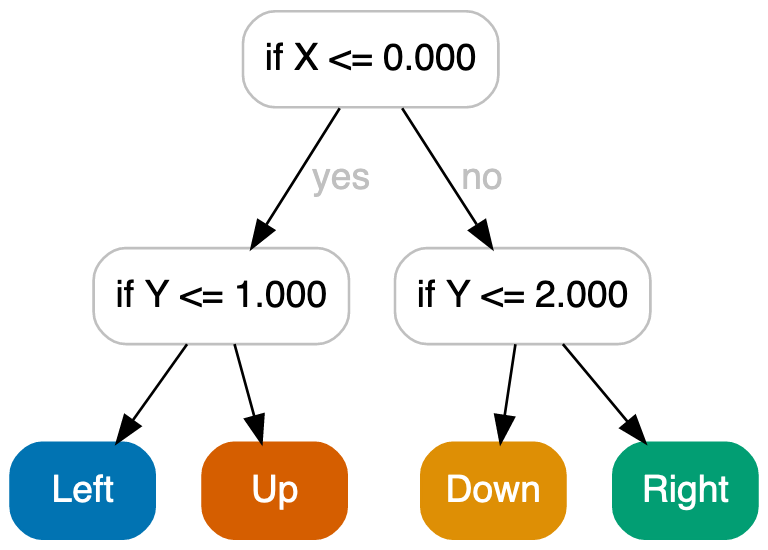

# OMDT: Optimal MDP Decision Trees

OMDT translates the problem of solving Markov Decision Processes (MDPs) with decision tree policies to Mixed-Integer Linear Programming (MILP). Using the Gurobi MILP solver we can solve decision trees for MDPs to optimality.

## Example

Below is some example code for generating an optimal decision tree of depth 2 on the frozenlake_4x4 environment.

```python
from environments.frozenlake_4x4 import generate_mdp

from omdt.solver import OmdtSolver

# Generates an MDP object with transition and reward matrix etc.
mdp = generate_mdp()

# Solve the MDP using a size-limited decision tree policy of depth 3
solver = OmdtSolver(
    depth=2,
    verbose=True,
)
solver.solve(mdp)

# The resulting omdt.tree.Tree policy is available as an attribute of the solver
# and can be exported to .dot / graphviz format for plotting
print(solver.tree_policy_.to_graphviz(
    mdp.feature_names,
    mdp.action_names,
))
```

When rendering the graphviz output it produces the following tree:


## Installing

To install all python dependencies run (within a virtual environment):
```
pip install -r requirements.txt
```

It might be necessary to upgrade pip to the newest version first to find the correct version of gurobi (10.0.0):
```
pip install --upgrade pip
```

To export the decision trees to figures we use pydot which also requires the `dot` command to be available in the `PATH`.

## Reproducing experiments

To run all experiments run:
```
./run_experiments.sh
```

If you wish to run the experiments in parallel on e.g. 8 cores we suggest the use of GNU Parallel for example:
```
parallel -j 8 :::: run_experiments.sh
```

After that the `out` directory will be populated with result files.

To print out information about the environments run:
```
python compute_mdp_properties.py
```
